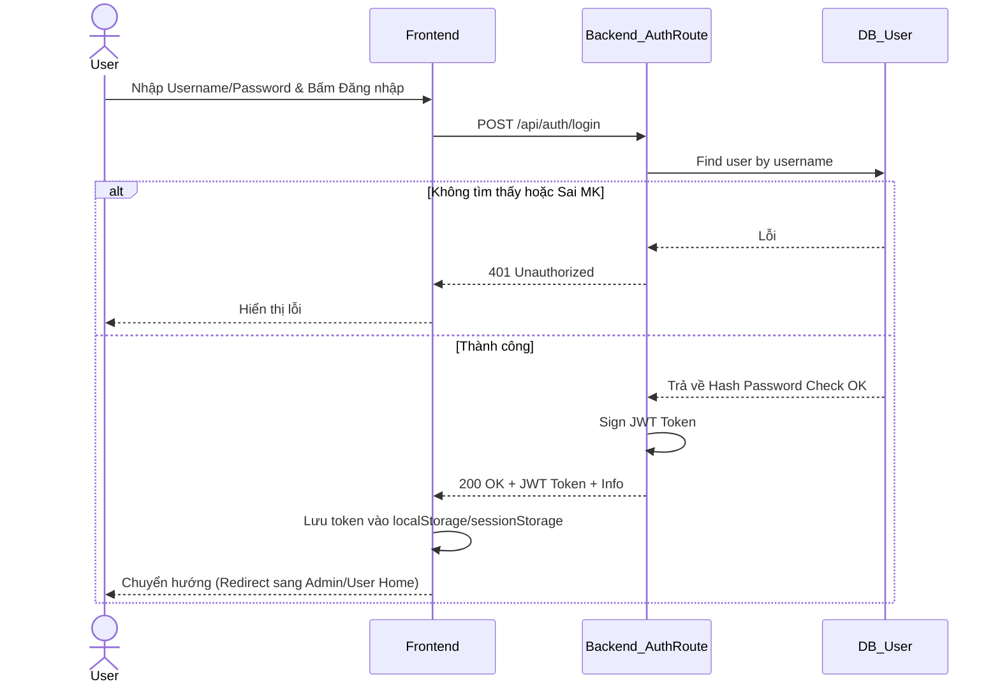
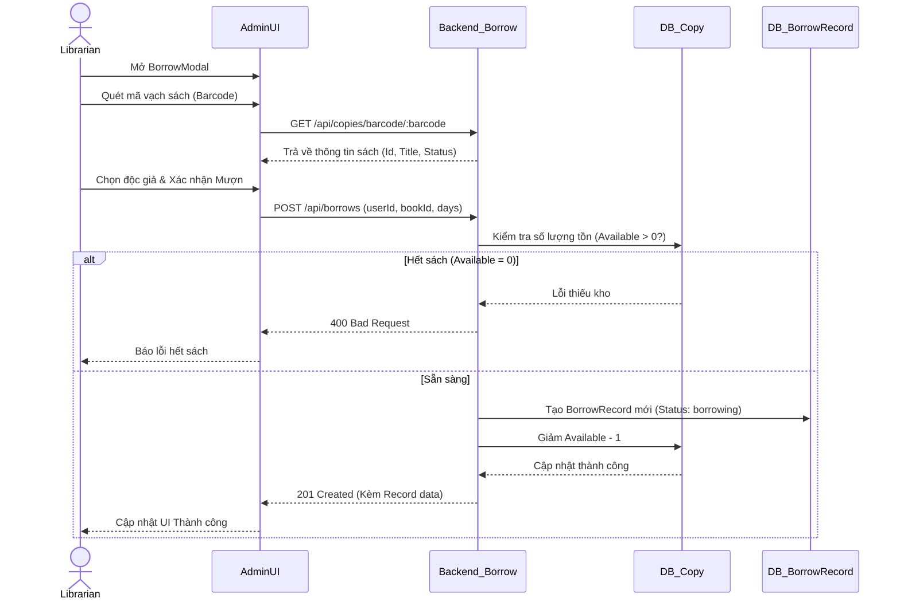
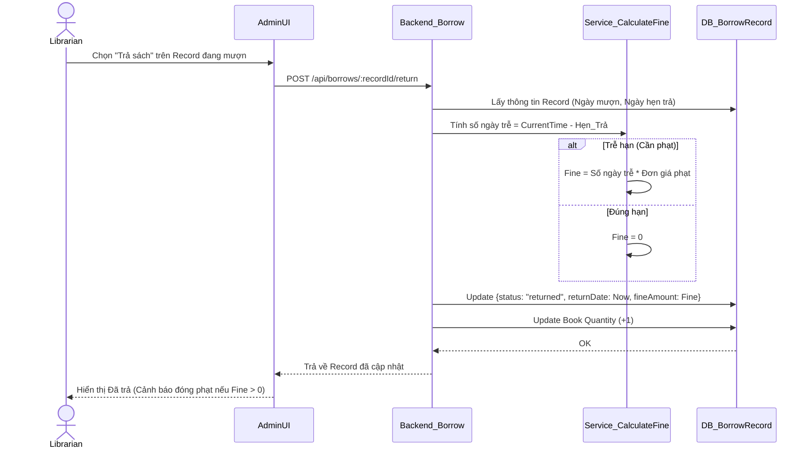

# LLM-Wiki: Thư viện Văn Học Việt Nam

Đây là tài liệu tham khảo nội bộ (Wiki) dành cho LLM và Dev để nắm bắt toàn bộ kiến trúc, luồng xử lý và các hàm quan trọng của dự án Thư viện.

## 1. Tổng quan Kiến trúc (Architecture)
- **Frontend**: Next.js 16 (App Router), Tailwind CSS. Sử dụng `axios` qua `src/lib/apiClient.ts`.
- **Backend**: Node.js / Express.js.
- **Database**: MongoDB (thông qua Mongoose).
- **Core Pattern**: Backend áp dụng mô hình Route -> Controller -> Service -> Repository (ví dụ: `borrowController` gọi `BorrowService`, `borrowService` gọi `BorrowRepository`).

---

## 2. Các File & Luồng quan trọng nhất (Core Files & Flows)

### 2.1 Backend - Authorization (`backend/src/middleware/auth.js`)
- `protect(req, res, next)`: Middleware giải mã JWT từ header `Authorization: Bearer <token>`. Gắn thông tin người dùng vào `req.user`. Nếu không hợp lệ sẽ trả về 401.
- `adminOnly(req, res, next)`: Middleware kiểm tra `req.user.role`. Chỉ cho phép `admin` hoặc `librarian` tiếp tục.

### 2.2 Backend - Quản lý mượn trả (`backend/src/controllers/borrowController.js`)
File này chịu trách nhiệm lớn nhất trong nghiệp vụ Thư viện (Circulation):
- `createBorrow`: Tạo phiếu mượn sách. Gọi `borrowService.createBorrow(userId, bookId, days, librarianId)` (Librarian ID được lấy từ `req.user`).
- `returnBook`: Trả sách. Gọi `borrowService.returnBook(recordId)`.
- `renewBook`: Gia hạn sách. Nhận `days`, cập nhật ngày trả.
- `getBorrowStats`: Hàm Aggregation MongoDB rất phức tạp lấy số liệu Dashboard: Top sách mượn, lượt mượn/trả 30 ngày, thống kê quá hạn.
- `triggerEmailReminders`: Kích hoạt hàm `sendDueReminders()` từ `cronJobs.js` để gửi email nhắc nhở độc giả.

### 2.3 Backend - AI Services (`backend/src/ai/`)
- Quản lý logic AI (Gemini).
- Bao gồm các module tách biệt như `context.manager.js`, `prompt.builder.js`, `response.formatter.js` và `ai.service.js` để xây dựng bot tư vấn đọc sách.

### 2.4 Frontend - Giao tiếp API (`frontend/src/lib/apiClient.ts`)
Tất cả request ra bên ngoài được gom vào đây:
- Khởi tạo Axios instance truy cập tới `NEXT_PUBLIC_API_URL` hoặc `http://localhost:5000`.
- **Request Interceptor**: Tự động đính kèm Token (ưu tiên `sessionStorage` cho Admin tab, sau đó là `localStorage`).
- **Response Interceptor**: Xử lý lỗi 401 (xóa token tự động khi phiên đăng nhập hết hạn).

### 2.5 Frontend - Thành phần UI chính (`frontend/src/components/admin/AdminModals.tsx`)
- `BookModal`: Có 2 tab là "Thông tin chung" và "Danh sách bản sao". Tương tác với API thêm/sửa sách và quản lý mã vạch (BookItems/Copies) qua hàm `addCopy()` và `deleteCopy()`.
- `BorrowModal`: Lập phiếu mượn. Có 2 chế độ:
  1. Quét mã vạch (gọi `getCopyByBarcode`).
  2. Chọn từ danh sách dropdown.

---

## 3. Bản đồ Quy trình BPMM (Mermaid Flows)

Dưới đây là các sơ đồ BPMN chi tiết để hiểu luồng nghiệp vụ.

### Flow 1: Đăng nhập & Xác thực API (Authentication Flow)

### Flow 2: Nghiệp vụ Mượn sách (Borrowing Flow)

### Flow 3: Trả sách và Tính phạt (Return & Fine Calculation)

---
*Wiki này được thiết kế để LLM đọc và hiểu ngữ cảnh sâu sắc trước khi thực hiện các yêu cầu debug sửa lỗi logic backend hoặc xây dựng API frontend mới.*
