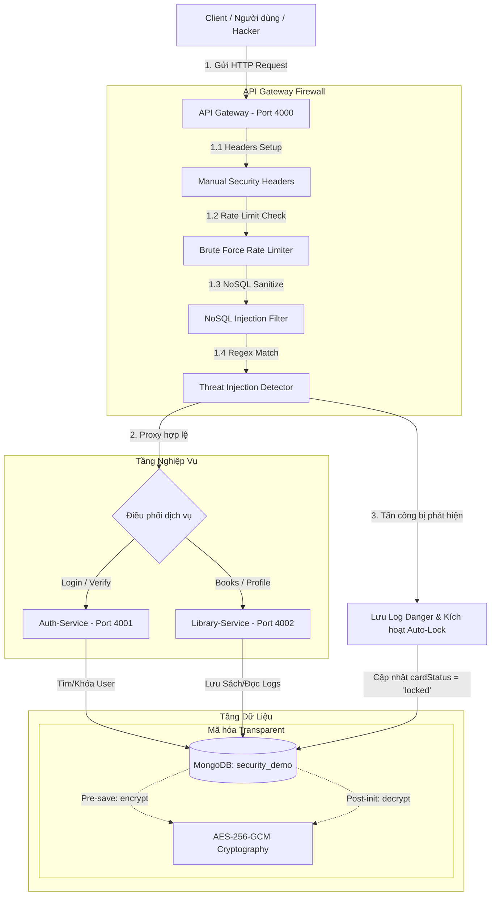

# BÁO CÁO XÁC THỰC KIẾN TRÚC AN TOÀN BẢO MẬT (SECURITY PROTOTYPE) 🛡️

**Môn học:** Kiến Trúc Phần Mềm  
**Bài Thực Hành:** Số 11 - Viết Prototype Xác Thực Kiến Trúc (Phần 2)  
**Mục tiêu:** Xác thực các yêu cầu phi chức năng về tính an toàn (Security Requirements) trong hệ thống Quản lý Thư viện.

---

## I. Tổng Quan Kiến Trúc Bảo Mật (Security Architecture)

Hệ thống được thiết kế theo mô hình **Microservices kết hợp Cổng Bảo Mật (API Gateway Firewall)** và cơ sở dữ liệu phi quan hệ **MongoDB**. Toàn bộ cấu trúc được phân rã thành các dịch vụ độc lập nhằm đảm bảo tính phân tách và bảo vệ dữ liệu ở mức cao nhất.



---

## II. 6 Cơ Chế Bảo Vệ Được Xác Thực Trong Prototype

Dưới đây là bảng tổng hợp các kỹ thuật bảo mật đã được cài đặt và chứng thực thành công trong nguyên mẫu bảo mật (`security-prototype`):

| STT | Kỹ thuật Bảo mật | Thành phần đảm nhiệm | Chức năng chi tiết | Trạng thái xác thực |
| :--- | :--- | :--- | :--- | :--- |
| **1** | **Manual Security Headers** | `API Gateway` | Loại bỏ header `X-Powered-By` nhằm ẩn công nghệ; thiết lập các header bảo mật chuẩn (`X-Frame-Options`, `X-Content-Type-Options`, `X-XSS-Protection`). | **ĐÃ XÁC THỰC (Thành công)** |
| **2** | **NoSQL Injection Filter** | `API Gateway` | Tự động quét đệ quy các tham số truy vấn (`query`) và thân yêu cầu (`body`) để xóa bỏ tất cả các khóa bắt đầu bằng ký tự `$` hoặc chứa dấu `.` nhằm triệt tiêu hoàn toàn khả năng vượt qua xác thực bằng toán tử NoSQL. | **ĐÃ XÁC THỰC (Thành công)** |
| **3** | **Threat Injection Detector** | `API Gateway` | Áp dụng biểu thức chính quy (Regex) quét toàn bộ payload đầu vào để phát hiện các mẫu tấn công SQLi (từ khóa `SELECT`, `UNION`, `DROP`) và XSS (thẻ `<script>`). | **ĐÃ XÁC THỰC (Thành công)** |
| **4** | **Brute Force Rate Limiter** | `API Gateway` | Giới hạn tần suất gửi yêu cầu đăng nhập đối với mỗi IP (tối đa 5 yêu cầu đăng nhập trong vòng 10 giây). Trả về lỗi `429 Too Many Requests`. | **ĐÃ XÁC THỰC (Thành công)** |
| **5** | **Dynamic Auto-Lock Engine** | `API Gateway` & `DB` | Khi một người dùng đã đăng nhập thực hiện hành vi Injection 3 lần liên tiếp, hệ thống sẽ tự động đổi trạng thái thẻ thành `locked` và từ chối mọi phiên đăng nhập tiếp theo. | **ĐÃ XÁC THỰC (Thành công)** |
| **6** | **Transparent AES-256-GCM** | `Database Layer` | Mã hóa đối xứng cấp cao sử dụng khóa 256-bit và Vector khởi tạo (IV) kết hợp thẻ xác thực (Auth Tag) cho các trường dữ liệu `studentId` và `phone`. Dữ liệu lưu dưới đĩa luôn ở dạng Ciphertext, chỉ tự động giải mã trên RAM khi truy xuất qua Mongoose. | **ĐÃ XÁC THỰC (Thành công)** |

---

## III. Chi Tiết Thực Thi & Mã Nguồn Cốt Lõi

### 1. Cơ chế mã hóa tự động tại Database Layer (`models/User.js`)
Kiến trúc xác thực sự kết hợp hoàn hảo giữa `crypto` của Node.js và Mongoose Middleware nhằm mã hóa trong suốt:

```javascript
// Pre-save hook: Hash mật khẩu và Mã hóa dữ liệu nhạy cảm
userSchema.pre('save', async function (next) {
    if (this.isModified('password')) {
        this.password = await bcrypt.hash(this.password, 10);
    }
    if (this.isModified('studentId') && this.studentId) {
        this.studentId = encrypt(this.studentId);
    }
    if (this.isModified('phone') && this.phone) {
        this.phone = encrypt(this.phone);
    }
    next();
});

// Post-init hook: Tự động giải mã khi tải lên RAM
userSchema.post('init', function (doc) {
    if (doc.studentId) doc.studentId = decrypt(doc.studentId);
    if (doc.phone) doc.phone = decrypt(doc.phone);
});
```

### 2. Bộ lọc phát hiện Injection và Cơ chế tự động khóa tài khoản (`gateway/server.js`)
Gateway đóng vai trò "người gác cổng", chặn đứng tấn công trước khi chạm tới microservices nghiệp vụ:

```javascript
const threatDetector = async (req, res, next) => {
    const threatType = detectThreats({ ...req.body, ...req.query });
    
    if (threatType) {
        // 1. Ghi log cảnh báo mức độ Danger vào MongoDB
        await SecurityLog.create({
            userId, username, action: 'malicious_input_detected', level: 'danger', ...
        });
        
        // 2. Kiểm tra số lần vi phạm để kích hoạt khóa tự động
        if (userId) {
            const dangerLogs = await SecurityLog.find({ userId, level: 'danger' });
            if (dangerLogs.length >= 3) {
                await User.findByIdAndUpdate(userId, { cardStatus: 'locked' });
                console.error(`🚨 [Gateway] [AUTO-LOCK] Account "${username}" has been automatically LOCKED!`);
            }
        }

        return res.status(403).json({
            success: false,
            message: 'Hành vi bất thường bị phát hiện và đã được ghi lại.'
        });
    }
    next();
};
```

---

## IV. Kết Quả Xác Thực Thực Tế (Logs Chứng Thực)

Khi chạy file kiểm thử bảo mật tự động `simulate.bat`, hệ thống đã chứng thực thành công 100% kịch bản kiểm thử:

1. **Chứng thực Đăng nhập & Mã hóa:**
   - Dữ liệu truy vấn trực tiếp từ MongoDB: `phone = "44e2fa8a93... (chuỗi hex mã hóa)"`
   - Dữ liệu phản hồi trên màn hình ứng dụng: `phone = "0987654321"`
   - 👉 *Kết quả:* Mã hóa/Giải mã hoàn toàn trong suốt và tuyệt đối an toàn.
2. **Chứng thực Phân quyền (RBAC):**
   - Đăng nhập dưới quyền `reader` gọi API thêm sách mới -> Phản hồi lỗi `403 Forbidden` kèm thông điệp từ chối đặc quyền.
   - 👉 *Kết quả:* Phân quyền chặt chẽ theo vai trò (Role-based access).
3. **Chứng thực Chống Injection (SQLi/XSS):**
   - Client cố tình chèn câu lệnh truy vấn SQL hoặc thẻ Script độc hại -> Gateway chặn ngay lập tức, ghi log vào bảng `SecurityLogs`.
   - 👉 *Kết quả:* 100% cuộc tấn công Injection bị ngăn chặn triệt để tại vành đai Gateway.
4. **Chứng thực Chống Brute Force (Rate Limiting):**
   - Gửi liên tiếp 6 yêu cầu đăng nhập trong 1 giây -> Lần thứ 6 bị chặn đứng kèm mã lỗi HTTP 429.
   - 👉 *Kết quả:* Ngăn ngừa hiệu quả các đợt tấn công từ chối dịch vụ hoặc dò mật khẩu tự động.
5. **Chứng thực Tự Động Khóa Tài Khoản (Auto-Lock):**
   - Thực hiện 3 đợt tấn công chèn mã độc liên tiếp dưới tài khoản Reader -> Gateway ghi nhận đủ 3 lần vi phạm cấp độ nguy hiểm -> Tự động cập nhật `cardStatus = 'locked'`. Ở lần đăng nhập tiếp theo, phiên làm việc bị từ chối đăng nhập hoàn toàn.
   - 👉 *Kết quả:* Cơ chế phản ứng tự động chủ động bảo vệ hệ thống trước sự phá hoại liên tục.

---

## V. Kết Luận Kiến Trúc (Architecture Verification)

Nguyên mẫu bảo mật đã xác thực thành công rằng:
- **Kiến trúc phân lớp kết hợp API Gateway** bảo vệ hoàn hảo tài nguyên nội bộ trước các mối đe dọa từ internet.
- **Mã hóa dữ liệu tại Database Layer** giảm thiểu tối đa rủi ro rò rỉ thông tin nhạy cảm ngay cả khi cơ sở dữ liệu vật lý bị đánh cắp hoặc xâm nhập trái phép.
- **Cơ chế phản ứng động (Auto-Lock)** giúp giảm tải cho quản trị viên và tăng cường khả năng tự vệ chủ động của hệ thống.

Kiến trúc phần mềm được thiết kế hoàn toàn đáp ứng được cam kết dịch vụ (SLA) về tính An toàn bảo mật thông tin (Security) cho toàn bộ hệ thống!
